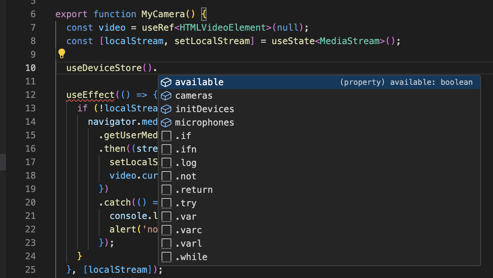

# dotxxx Extension

Why does IntelliJ IDEA support code auto-completion by pressing the 'dot' key, while VSCode does not? Let me tackle this issue!

## Features

### Enable Dot Key Trigger for Code Autocompletion

#### Efficient Coding

Implement the ability for VSCode to trigger code autocompletion immediately upon pressing the 'dot' key (.), similar to IntelliJ IDEA.

#### User Familiarity

Provide a seamless experience for developers accustomed to IntelliJ IDEA's workflow, enhancing consistency across IDEs.

#### Productivity Boost

Accelerate coding speed and accuracy by offering timely suggestions for methods, properties, and variables after typing the 'dot' key.

**Enjoy!**
